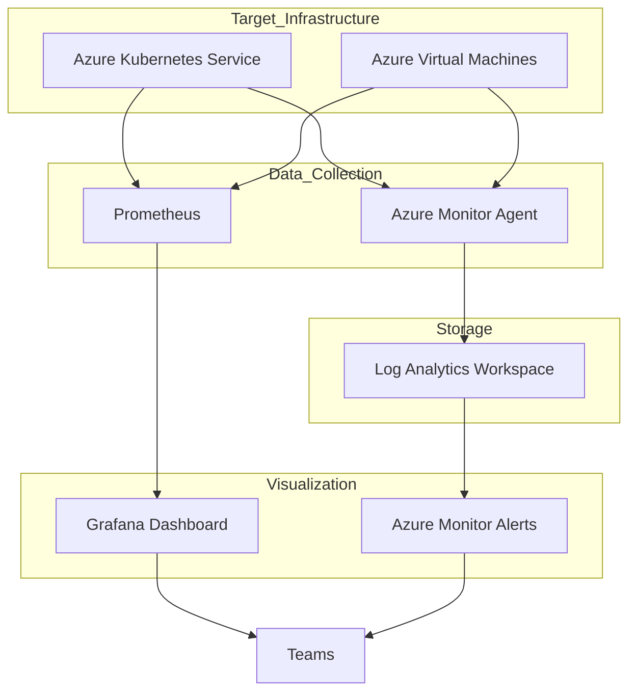

# 📊 Production-Ready Azure VM Monitoring & Observability Platform


Production-grade Azure monitoring and observability platform implementing infrastructure telemetry, operational visibility, KQL analytics, alert engineering and cloud monitoring workflows aligned with SRE and DevOps operational practices.

---

# 📌 Executive Summary

Designed and implemented enterprise cloud observability platform using:

✅ Azure Monitor

✅ Log Analytics Workspace

✅ Azure Alerts

✅ Azure Workbooks

✅ Linux Infrastructure Monitoring

✅ Kusto Query Language (KQL)

✅ Operational Visibility

✅ Dashboard Visualization

✅ Incident Detection

✅ Performance Monitoring

✅ Cost Optimization

---

# 🎯 Business Requirement

Modern production infrastructure requires:

❌ Missing telemetry visibility

❌ Delayed incident detection

❌ Manual monitoring process

❌ No operational dashboard

❌ Slow troubleshooting

❌ Missing alert automation

This project solves those challenges using Azure-native observability architecture.

---

# 🛠 Prerequisites

Ensure environment readiness.

| Requirement | Details |
|-------------|----------|
| Azure Subscription | Active |
| Azure Monitor | Enabled |
| Ubuntu Linux VM | Deployed |
| Log Analytics Workspace | Configured |
| Azure CLI | Installed |
| SSH Access | Enabled |
| Monitoring Permissions | Contributor |

Authenticate:

```bash
az login
```

Verify:

```bash
az --version
```

---

# 🏗️ Architecture Design



---

# ⚙️ Core Monitoring Components

### 📊 Azure Monitor

Capabilities:

✅ VM Monitoring

✅ Metric Collection

✅ VM Insights

✅ Infrastructure Visibility

---

### 📑 Log Analytics Workspace

Capabilities:

✅ Centralized Logging

✅ Telemetry Collection

✅ KQL Query Analytics

---

### 📈 Azure Workbooks

Capabilities:

✅ Dashboard Visualization

✅ Trend Analysis

✅ Infrastructure Analytics

---

### 🔍 KQL Analytics

Capabilities:

✅ CPU Monitoring

✅ Heartbeat Monitoring

✅ Syslog Analysis

✅ Performance Investigation

---

### 🚨 Azure Alerts

Capabilities:

✅ Automated Alerting

✅ Threshold Detection

✅ Incident Notification

---

# 🚨 Production Alerting Thresholds Built-In

🔴 High CPU Utilization

Trigger:

CPU > 85% for 5 minutes

---

🔴 High Memory Usage

Trigger:

Memory > 85%

---

🟡 Disk Space Warning

Trigger:

Disk Utilization > 85%

---

❌ Service Failure

Trigger:

Critical Service Down

---

🚨 Notification Targets

Configured:

- Email Notification
- Azure Alert Action Group
- Incident Visibility

---

# ⚙️ Configuration Variables

Modify deployment using:

terraform.tfvars

| Variable Name | Description | Default Value |
|---|---|---|
| resource_group_name | Resource Group | azure-monitoring-rg |
| location | Azure Region | East US |
| retention_in_days | Log Retention | 30 |
| workspace_name | LAW Name | prod-law |
| cpu_alert_threshold | CPU Alert Value | 85 |

---

# ⚙️ Technology Stack

| Technology | Purpose |
|---|---|
| Azure Monitor | Monitoring |
| Azure Alerts | Incident Detection |
| Log Analytics | Log Collection |
| Azure Workbooks | Dashboard |
| Ubuntu Linux | OS |
| NGINX | Web Layer |
| SSH | Access |
| KQL | Query Engine |

---

# 🚀 Infrastructure Setup

Implemented:

✅ Ubuntu Linux VM

✅ NSG Configuration

✅ Public IP

✅ SSH Access

✅ Web Application Hosting

---

# 📈 Monitoring Implementation

Configured:

### Azure Monitor

- VM Insights

- Metrics Collection

- CPU Analytics

---

### Log Analytics

Implemented:

- Telemetry Collection

- Query Analytics

- Log Visibility

---

### Alert Engineering

Configured:

- Metric Alerts

- CPU Threshold

- Email Notifications

---

# 🔥 Incident Simulation

Stress utility:

```bash
sudo apt update

sudo apt install stress -y

stress --cpu 4 --timeout 600
```

Validated:

✅ CPU Spike

✅ Alert Trigger

✅ Email Notification

✅ Dashboard Visibility

---

# 📑 KQL Query Examples

## CPU Query

```kql
InsightsMetrics

| where Namespace=="Processor"

| summarize AvgCPU=avg(Val)

by bin(TimeGenerated,5m)

| render timechart
```

---

## Heartbeat Query

```kql
Heartbeat

| sort by TimeGenerated desc

| take 10
```

---

## Syslog Query

```kql
Syslog

| sort by TimeGenerated desc

| take 50
```

---

# 📸 Project Proof Screenshots

## VM Monitoring Dashboard


---

## Network Dashboard


---

## Disk Monitoring


---

## Azure Monitor


---

## CPU Alert Rule


---

## Email Notification


---

## Alert Dashboard


---

## Heartbeat Query


---

## CPU Stress Testing


---

## Deployment Validation


---

# ⚠️ Engineering Challenges Solved

| Challenge | Solution |
|---|---|
| SSH Failure | Native SSH + PEM |
| Missing Alerts | CPU Stress Validation |
| Logs Missing | AMA Validation |
| Cost Issue | Bastion Removal |

---

# 🧠 Skills Demonstrated

Azure Monitor

Azure Alerts

KQL

Azure Workbooks

Cloud Monitoring

Incident Engineering

Observability Engineering

Dashboard Visualization

Linux Administration

Operational Visibility

Cloud Operations

SRE Practices

---

# 📈 Business Outcome

Successfully implemented cloud-native monitoring platform supporting:

✅ Incident Detection

✅ Infrastructure Visibility

✅ Alert Engineering

✅ Dashboard Visualization

✅ Linux Monitoring

✅ Operational Troubleshooting

---

# 👨‍💻 Author

## Amit Kumar

Cloud Engineer | Azure Administrator | Observability Engineer

GitHub

https://github.com/Akamitt009

LinkedIn

https://www.linkedin.com/in/amit-kumar-657255232/
