# 📊 Production-Ready Azure VM Monitoring & Observability Platform


Production-grade Azure monitoring and observability platform implementing infrastructure telemetry, operational visibility, KQL analytics, automated alerting and cloud monitoring workflows aligned with modern DevOps and SRE operational practices.

---

# 📌 Executive Summary

Designed and implemented enterprise cloud observability platform using:

✅ Azure Monitor

✅ Azure Alerts

✅ Azure Log Analytics Workspace

✅ Azure Workbooks

✅ Linux Infrastructure Monitoring

✅ Kusto Query Language (KQL)

✅ Automated Incident Alerting

✅ Dashboard Visualization

✅ Cost Optimization

✅ Operational Troubleshooting

---

# 🎯 Business Requirement

Modern production systems require:

❌ No infrastructure visibility

❌ Manual monitoring processes

❌ Delayed incident detection

❌ Missing telemetry collection

❌ Lack of operational dashboards

❌ Slow troubleshooting workflows

This project solves those challenges using Azure-native monitoring architecture.

---

# 🛠 Prerequisites

Before deployment ensure:

| Requirement | Details |
|-------------|----------|
| Azure Subscription | Active |
| Azure Monitor | Enabled |
| Linux VM | Ubuntu VM |
| Log Analytics Workspace | Configured |
| SSH Access | Enabled |
| Azure CLI | Installed |
| Monitoring Permissions | Monitoring Contributor |

Verify Azure CLI:

```bash
az --version
```

Authenticate Azure:

```bash
az login
```

---

# 🏗 Enterprise Monitoring Architecture

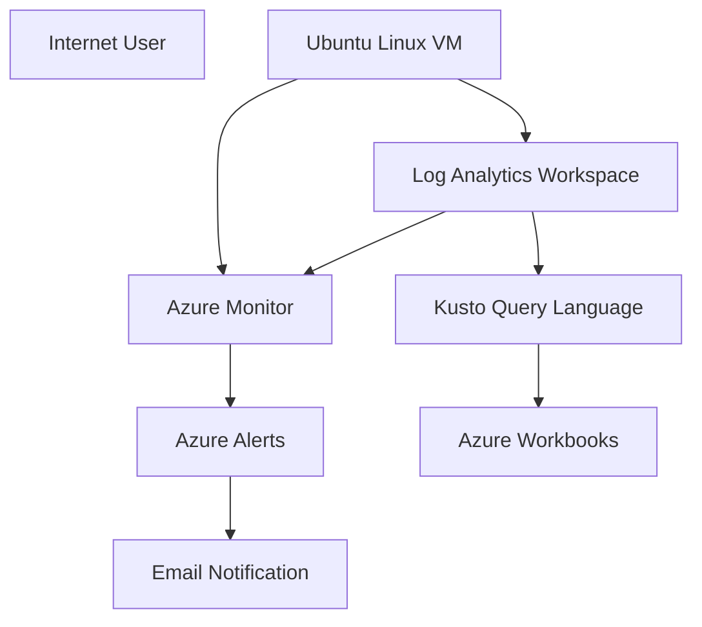

---

# ⚙️ Core Monitoring Components

### 📊 Azure Monitor

Centralized monitoring platform.

Capabilities:

✅ CPU Monitoring

✅ Metric Collection

✅ VM Insights

✅ Performance Visibility

---

### 📑 Log Analytics Workspace

Centralized telemetry ingestion.

Capabilities:

✅ Log Collection

✅ Infrastructure Analytics

✅ Query Processing

✅ Data Correlation

---

### 🚨 Azure Alerts

Incident detection system.

Capabilities:

✅ Automated Alerting

✅ Threshold Validation

✅ Notification Automation

---

### 📈 Azure Workbooks

Visualization platform.

Capabilities:

✅ Dashboard Creation

✅ Operational Visibility

✅ Interactive Analytics

---

### 🔍 KQL Analytics

Query engine implementation.

Capabilities:

✅ Infrastructure Queries

✅ Performance Analysis

✅ Heartbeat Monitoring

---

# ⚙️ Configuration Variables

| Variable | Description | Example |
| :--- | :--- | :--- |
| vm_name | Linux VM Name | monitoring-vm |
| cpu_threshold | CPU Alert Threshold | 70 |
| region | Azure Region | East US |
| retention_days | Log Retention | 30 |
| workspace_name | LAW Name | prod-law |

---

# ⚙️ Technology Stack

| Technology | Purpose |
|---|---|
| Azure VM | Infrastructure |
| Ubuntu Linux | Operating System |
| NGINX | Web Layer |
| Azure Monitor | Monitoring |
| Azure Alerts | Incident Response |
| Log Analytics | Telemetry Platform |
| Azure Workbooks | Dashboard Visualization |
| KQL | Query Engine |
| SSH | Linux Access |

---

# 🚀 Infrastructure Setup

### Linux VM Deployment

Created:

✅ Ubuntu Linux VM

✅ Public IP

✅ NSG Rules

✅ SSH Authentication

Hosted:

NGINX Web Application

---

# 📈 Enterprise Monitoring Implementation

## Azure Monitor

Configured:

- Azure Monitor

- VM Insights

- Metrics Collection

- Performance Analytics

---

## CPU Monitoring

Configured:

- Percentage CPU

- Real-Time Metrics

- Performance Visualization

---

# 🚨 Incident Alerting Platform

Alert Configuration:

| Configuration | Value |
|---|---|
| Alert Type | Metric Alert |
| Metric | Percentage CPU |
| Threshold | >70% |
| Severity | Sev2 |
| Notification | Email |
| Evaluation | Real Time |

---

# 🔥 Incident Simulation

Stress utility:

```bash
sudo apt update

sudo apt install stress -y

stress --cpu 4 --timeout 600
```

Validated:

✅ CPU Spike Detection

✅ Alert Trigger

✅ Email Notification

✅ Dashboard Update

---

# 📑 KQL Queries

## CPU Monitoring Query

```kql
InsightsMetrics

| where Namespace=="Processor"

| summarize AvgCPU=avg(Val)

by bin(TimeGenerated,5m)

| render timechart
```

---

## Heartbeat Monitoring

```kql
Heartbeat

| sort by TimeGenerated desc

| take 10
```

---

## Syslog Query

```kql
Syslog

| sort by TimeGenerated desc

| take 50
```

---

# 📸 Project Proof Screenshots

## VM Monitoring Dashboard

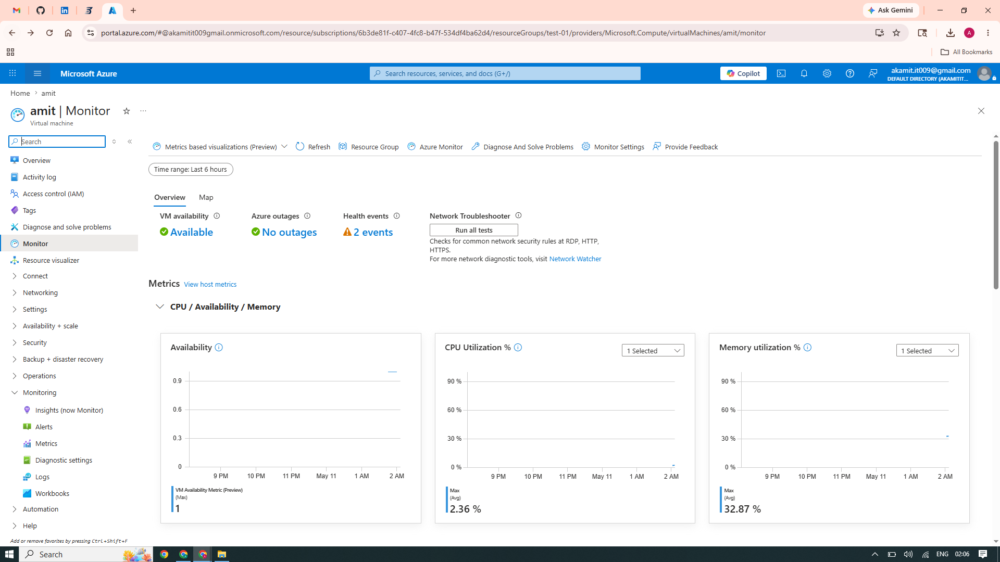

---

## Network Monitoring Dashboard

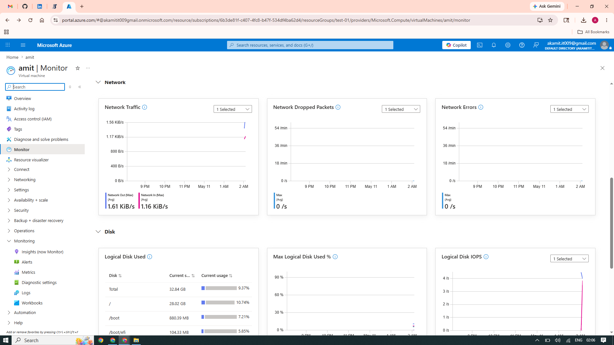

---

## Disk Monitoring Dashboard

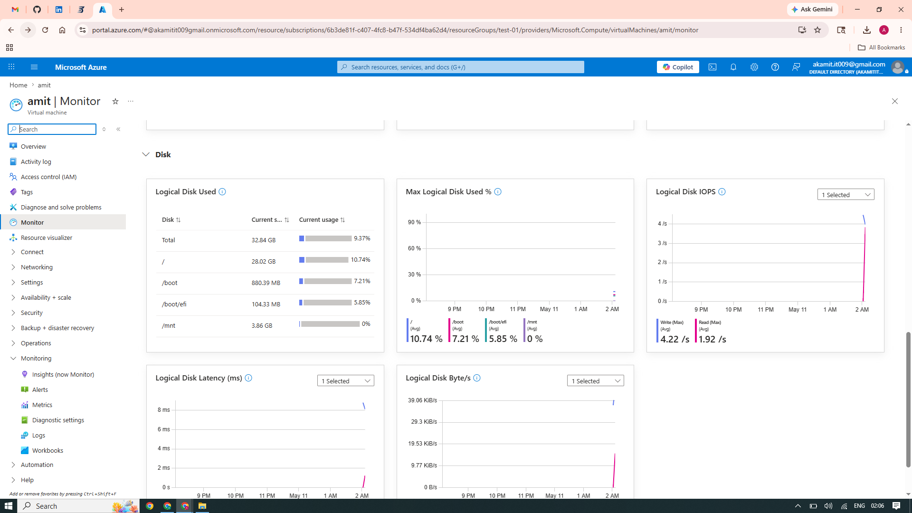

---

## Azure Monitor Onboarding

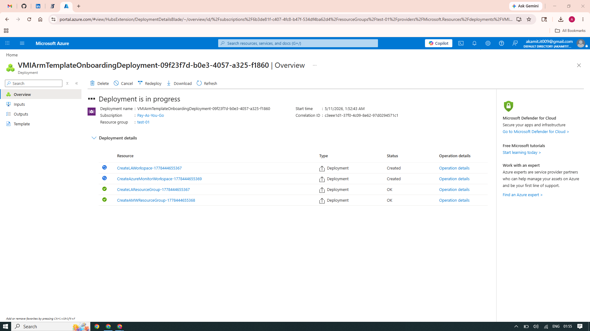

---

## CPU Alert Rule

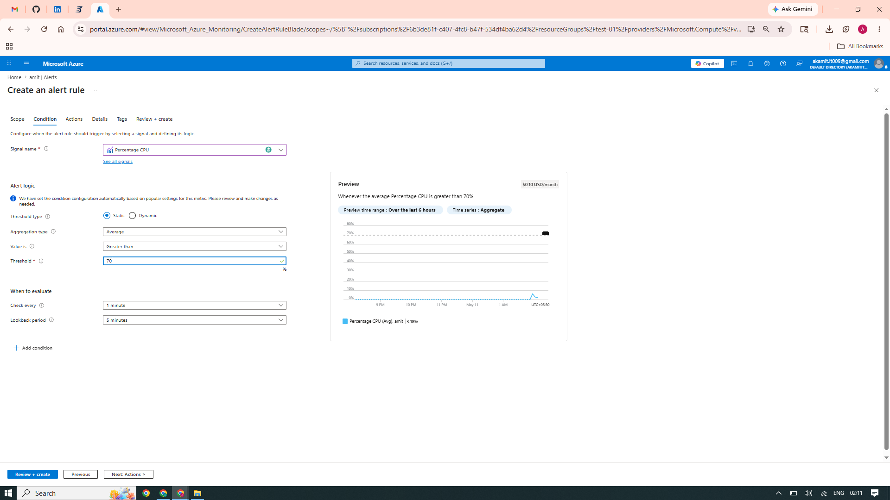

---

## Email Action Group

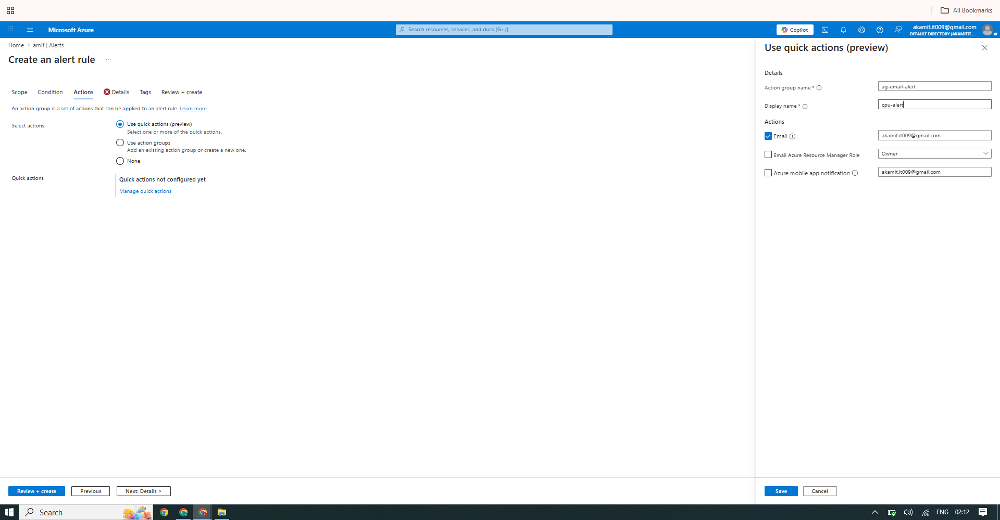

---

## Alert Review

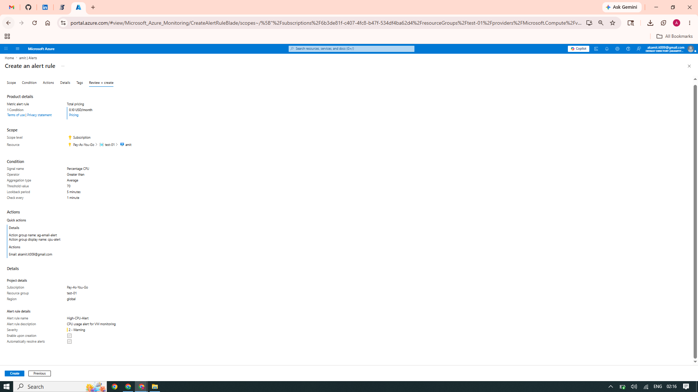

---

## Alerts Dashboard

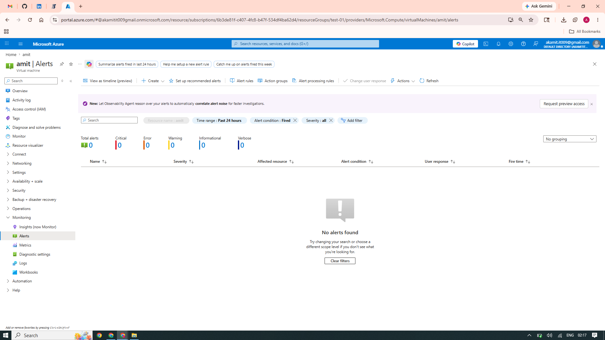

---

## Email Notification


---

## Email Notification Validation

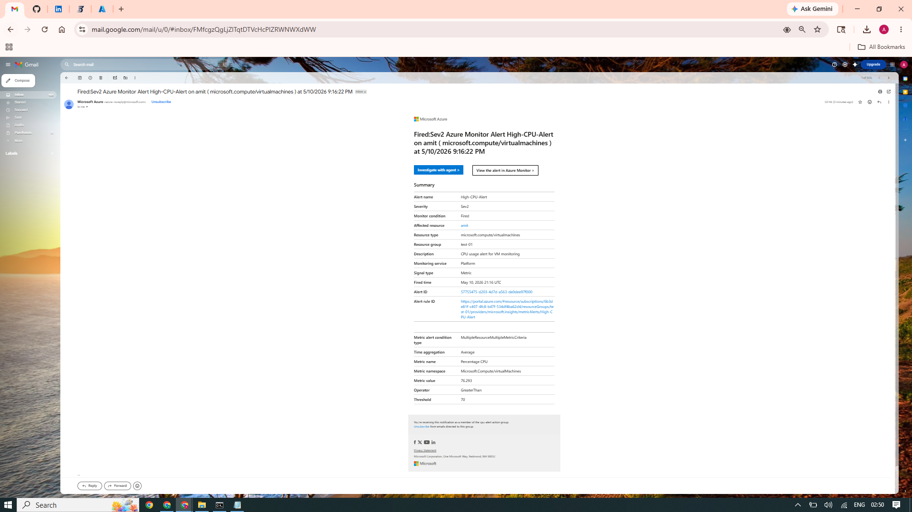

---

## Heartbeat Query

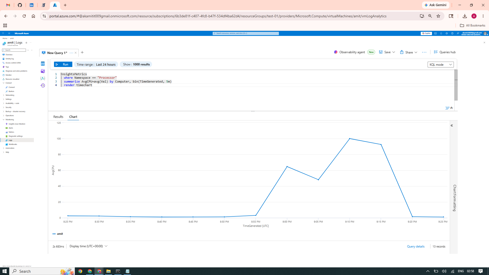

---

## Heartbeat Results

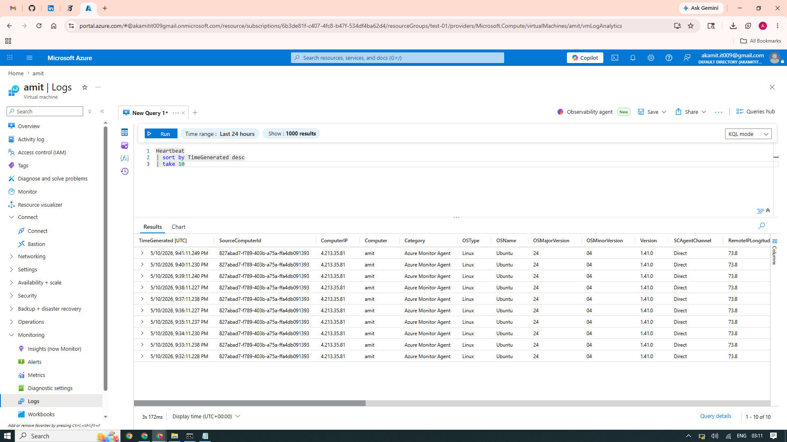

---

## CPU Stress Validation

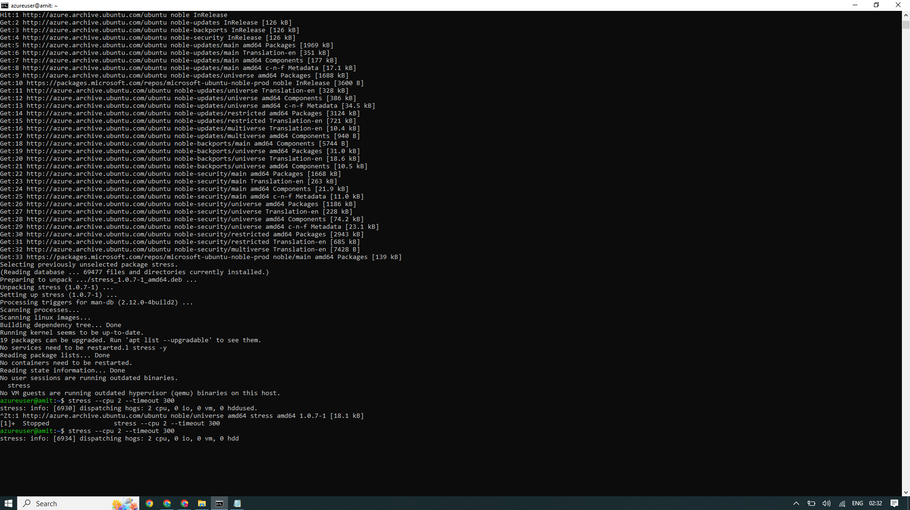

---

## Deployment Validation

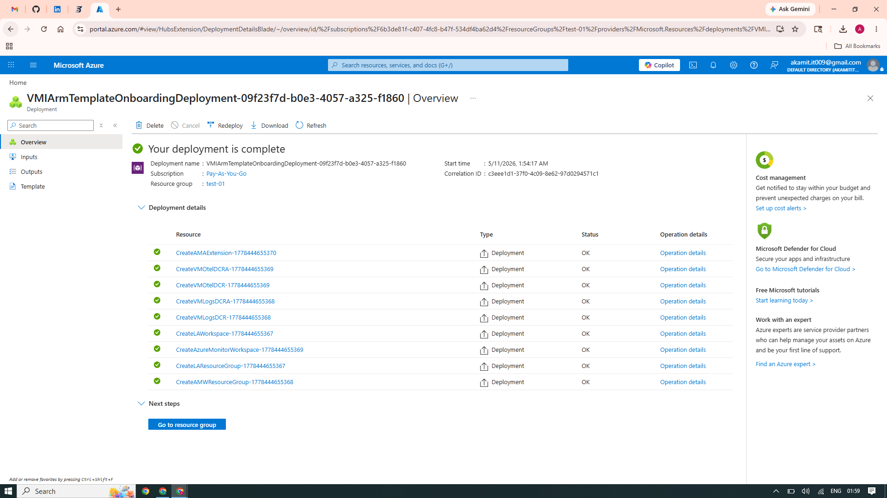

---

# ⚠️ Engineering Challenges Solved

| Challenge | Solution |
|---|---|
| SSH Failure | Native SSH + PEM |
| Alerts Not Triggering | Stress Utility |
| Missing Logs | AMA Validation |
| Cost Increase | Bastion Removal |

---

# 🧠 Skills Demonstrated

Azure Monitor

Azure Alerts

KQL

Azure Workbooks

Cloud Monitoring

Incident Engineering

Linux Administration

Infrastructure Monitoring

Operational Visibility

Dashboard Engineering

Cloud Operations

Observability Engineering

---

# 📈 Business Outcome

Successfully implemented cloud-native observability platform supporting:

✅ Infrastructure Monitoring

✅ Incident Detection

✅ Alert Engineering

✅ Linux Visibility

✅ Dashboard Visualization

✅ Operational Troubleshooting

---

# 👨‍💻 Author

## Amit Kumar

Cloud Engineer | Azure Administrator | Observability Engineer

GitHub

https://github.com/Akamitt009

LinkedIn

https://www.linkedin.com/in/amit-kumar-657255232/
